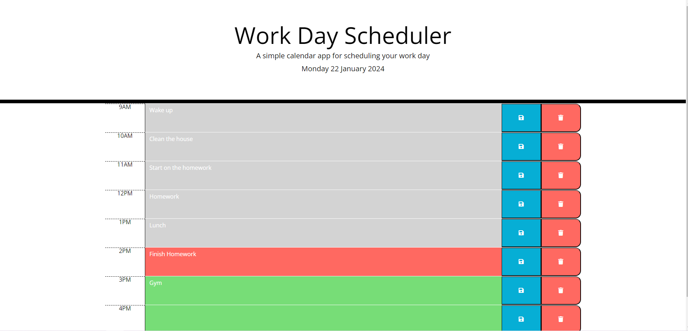
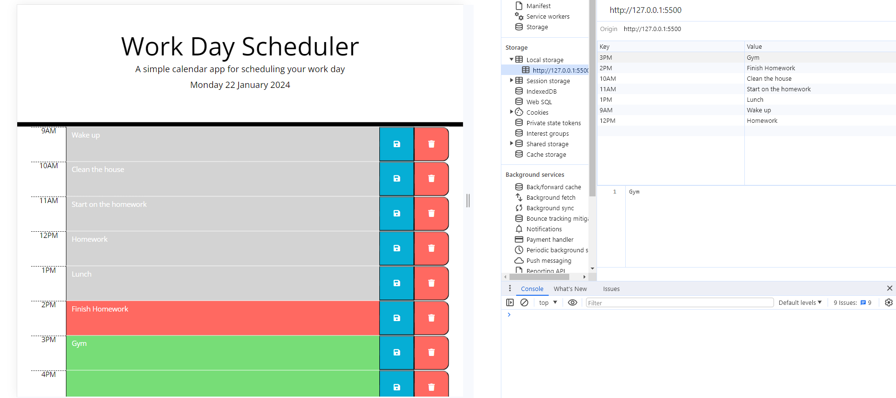

# Workday Scheduler 


<details>
  <summary>Table of Contents</summary>
  <ol>
    <li><a href="#Description">Description</a></li>
    <li><a href="#Screenshot">Screenshot</a></li>
    <li><a href="#Installation">Installation</a></li>
    <li><a href="#Usage">Usage</a></li>
    <li><a href="#Link">Link</a></li>
    <li><a href="#Credits">Credits</a></li>
    <li><a href="#License">License</a></li>
  </ol>
</details>


## Description
The main purpose of this simple work day scheduler is to display the current day at the top of the page when the user opens up the planner. The scheduler presents timeblocks for the standard business hours and color codes each timeblock based on the past, present and future. The user is able to click on each timeblock and enter an event, by pressing the save or delete button the user is able to save and delete events. Because this app uses local storage events persist between refreshes of the page. 


## Screenshot





## Installation


To install this project clone the repo
    ```
    git@github.com:Dominik-Jad/work-day-scheduler.git
    ```


Open the files in VS Code and select 'Open With Live Server' on index.html. There you can fill out your schedule for today and save it to local storage so that it is saved even after refreshing the page 





## Usage


The workday scheduler is very simple to use. The user can simply adjust their working hours by chaning the values in the workingHours array. To use this app the user can click on the text area and type in their tasks for each hour of their working day. By clicking the save and delete button the user is able to save tasks and delete them as needed. This app will help users manage their time more effectively. 


## Link


https://dominik-jad.github.io/work-day-scheduler/


## Credits


Dayjs - https://day.js.org/docs/en/parse/string-format/

jQuery - https://api.jquery.com/ 

## Licence


Please refer to the LICENCE in the repo.


